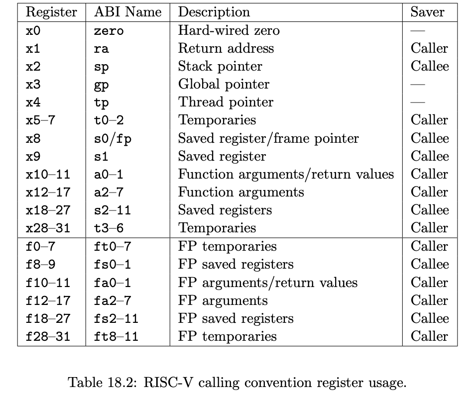

# RISC-V Emulator in Rust

## Disclaimer

This purpose of this implementation is an educational only. I used as guideline
the [rvemu book](https://book.rvemu.app/).

## RISC-V ISA

- Consists of modules:
    - A base integer ISA
    - Optional extensions.

- In the base integer ISA there are 2 variants:
    - RV32I for a 32-bit architecture.
    - RV64I for a 64-bit architecture.

- There are also General Purpose ISAs that allow complex systems to run on 
RISC-V hardware: RV32G and RV64G.

- Here is the list of ISAs that RV64G includes:
    - RV64I: base integer instructions
    - RV64M: integer multiplication and division instructions
    - RV64A: atomic instructions
    - RV64F: single-precision floating-point instructions
    - RV64D: double-precision floating-point instructions
    - RVZicsr: control and status register instructions
    - RVZifencei: instruction-fetch fence instructions

- As in the book the goal is to run xv6 so we will implement only the instructions
xv6 uses:
    - RV64I 
    - RVZicsr 
    - a part of RV64M 
    - a part of RV64A.

### Install RISC-V Toolchain on MacOS

```bash
brew install riscv64-elf-gcc riscv64-elf-binutils riscv64-elf-gdb
```

- if the command above is not working use the following two commands

```bash
brew tap riscv-software-src/riscv
brew install riscv-gnu-toolchain
```

- add the path to .zshrc or .bashrc

```bash
echo 'export PATH="$(brew --prefix riscv-gnu-toolchain)/bin:$PATH"' >> ~/.zshrc
source .zshrc
```

**Verify the installation**

```bash
riscv64-unknown-elf-gcc --version
riscv64-unknown-elf-objdump --version
```

## Registers

- There are 32 general-purpose registers that are each 64-bit wide in RV64I.
- Each register has a role defined by the ***integer register convention***.



